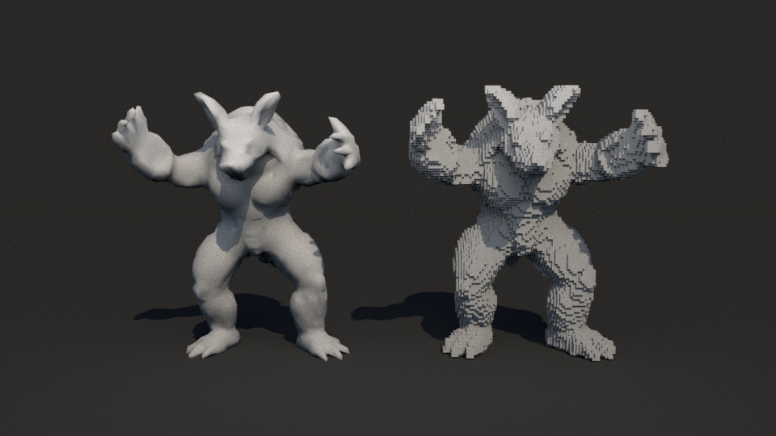
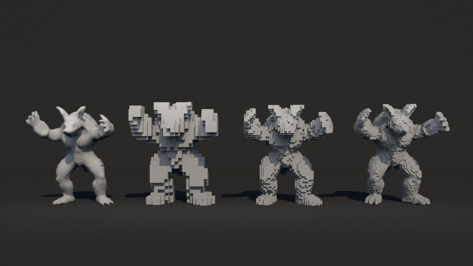

# Maya Voxelizer Plug-in




## Usage
1. Download or build the plug-in. For macOS, there is a pre-built binary [here](https://github.com/i-yam-jeremy/maya-retopo-plugin/releases/latest). If you are using another system, follow the build instructions below.

2. Install the plug-in in Maya. Go to Windows > Settings/Preferences > Plug-in Manager. The click "Browser" and select the compiled binary.

3. Select the mesh you want to voxelize.

4. Type `voxelize resolution` into the MEL command bar, where `resolution` is the voxel size in world coordinates. A smaller size takes longer to compute and results in a denser voxel mesh. For objects of similar size to the default primitives, `0.01` is a good starting resolution.
  
## Building

Make sure CMake and Make are installed on your system, then run the following commands.

```
cd <maya-voxelizer-plugin>
cmake .
make
``` 

## Demo Model Source
[Stanford Armadillo](https://graphics.stanford.edu/data/3Dscanrep/)
